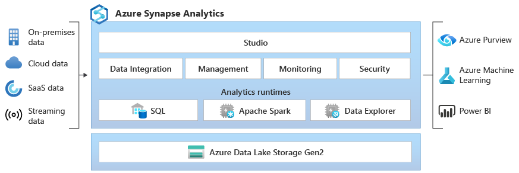

# Azure Synapse Workspace

An **Azure Synapse Workspace** is a securable collaboration boundary for doing cloud-based enterprise analytics in Azure. A workspace is deployed in a specific region and has an associated Azure Data Lake Storage (ADLS) Gen2 account and file system (for storing temporary data). 



## Simple Use Case

Let's say you have a CSV-based file or a Parquet-based file, and you wanna analyze quickly the data within the file. How can you do this?

You could try to view the CSV file, but if the file is large, how do you analyze a file? If you have a Parquet based-file, how do you analyze the data within the file?

If you quickly want to go ahead and analyze the data, you can actually make use of the **built-in serverless SQL pool** that allows you to query data in an Azure Data Lake Gen2 storage account.

**NOTE. You are not charged based on the compute of the serverless SQL pool. You are charged based on the data that's being processed by queries.**

## Reading a JSON file with OPENROWSET function

```
SELECT 
*
-- JSON_VALUE(jsonContent), '$.<field_name>') as fieldName
FROM OPENROWSET (
    BULK '<file_url>'
    FORMAT = 'csv'
    FIELDTERMINATOR = '0x0b'
    FIELDQUOTE = '0x0b',
    ROWTERMINATOR = '0x0a'
)
WITH (
    jsonContent varchar(MAX)
)
AS ROWS
```

## Using an External Table 

0. (Optional) Create a credential

```
CREATE MASTER KEY ENCRYPTION BY PASSWORD = '<password>'

CREATE DATABASE SCOPED CREDENTIAL <credential_name>
WITH IDENTITY = 'SHARED ACCESS SIGNATURE'
SECRET = '<sas_token>'
```

1. Create an external data source

```
CREATE EXTERNAL DATA SOURCE <data_source_name>
WITH (
    LOCATION='<prefix>://<path>'
    [, CREDENTIAL = <credential_name>]
)
```

2. Create an external file format

```
CREATE EXTERNAL FILE FORMAT <file_format_name>
WITH (
    FORMAT_TYPE = DELIMITEDTEXT
    [, FORMAT_OPTIONS (..)]
    [, DATA COMPRESSION = ..]
)
```

3. Create an external table

```
CREATE EXTERNAL TABLE <external_table_name>
(
 ...
)
WITH (
    LOCATION = '/<file_name>'
    DATA_SOURCE = <data_source_name>
    FILE_FORMAT = <file_format_name>
)
```