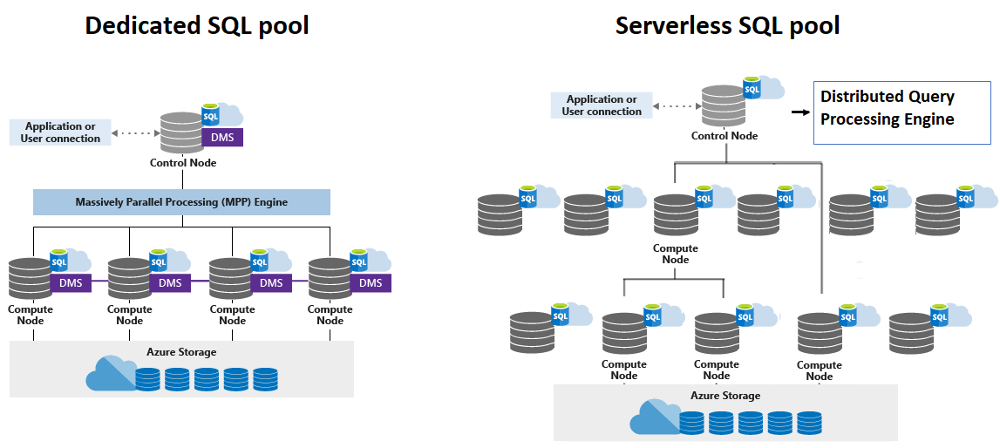

# Azure Dedicated SQL Pool

**Azure Dedicated SQL pool** (formerly SQL DW) refers to the enterprise data warehousing features that are available in Azure Synapse Analytics.

Synapse SQL uses a scale-out architecture to distribute computational processing of data across multiple nodes. **Compute is separate from storage**, which enables you to **scale compute independently of the data** in your system.

For dedicated SQL pool, the unit of scale is an abstraction of compute power that is known as a **data warehouse unit (DWU)**.

For serverless SQL pool, being serverless, scaling is done automatically to accommodate query resource requirements. As topology changes over time by adding, removing nodes or failovers, it adapts to changes and makes sure your query has enough resources and finishes successfully. 

With decoupled storage and compute, when using Synapse SQL one can benefit from independent sizing of compute power irrespective of your storage needs. For serverless SQL pool scaling is done automatically, while for dedicated SQL pool one can:
- grow or shrink compute power, within a dedicated SQL pool, without moving data
- pause compute capacity while leaving data intact, so you only pay for storage
- resume compute capacity during operational hours



## Dedicated SQL Pool vs Serverless SQL Pool

With the Serverless SQL pool, you can just define the table schema, but the data itself resides in external storage.

If you need to persist the data in actual tables and query them via SQL, you need to a SQL data warehouse in place. You can host a SQL data warehouse with the help of dedicated SQL pool.

**NOTE**. In the dedicated SQL pool, in addition to creating our normal tables, you can also create external tables as well.

## Hash Distribution tables vs Round-Robin Distribution tables

A distributed table appears as a single table, but the rows are actually **stored across 60 distributions**. The rows are distributed with a hash or round-robin algorithm.

**Hash-distribution** improves query performance on large fact tables. **Round-robin distribution** is useful for improving loading speed. These design choices have a significant effect on improving query and loading performance.

A hash-distributed table distributes table rows across the compute nodes by using a deterministic hash function to assign each row to one distribution. A hash-distributed table has a **distribution column or set of columns that is the hash key**.

A round-robin distributed table distributes table rows evenly across all distributions. The assignment of rows to distributions is random. Unlike hash-distributed tables, rows with equal values are not guaranteed to be assigned to the same distribution. Consider using the round-robin distribution for your table when the table is a **temporary staging table**.

**NOTE.** When you don't specify any sort of distribution, the default is the Round-Robin distribution.

```
CREATE TABLE [dbo].[FactInternetSales]
(   
    [ProductKey]        int          NOT NULL,
    [OrderDateKey]      int          NOT NULL,
    [CustomerKey]       int          NOT NULL,
    [PromotionKey]      int          NOT NULL,
    [SalesOrderNumber]  nvarchar(20) NOT NULL,
    [OrderQuantity]     smallint     NOT NULL,
    [UnitPrice]         money        NOT NULL,
    [SalesAmount]       money        NOT NULL
)
WITH
(   
    CLUSTERED COLUMNSTORE INDEX,  
    DISTRIBUTION = HASH([ProductKey])
);
```

## Replicated Tables

Another table storage option is to **replicate** a small table across all the compute nodes. 

Replicated tables work well for dimension tables in a star schema. Dimension tables are typically joined to fact tables, which are distributed differently than the dimension table. 

Dimensions are usually of a size that makes it feasible to store and maintain multiple copies.


