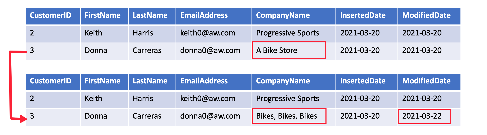
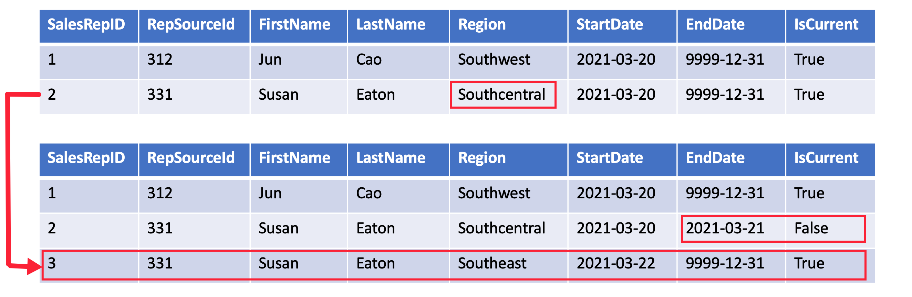
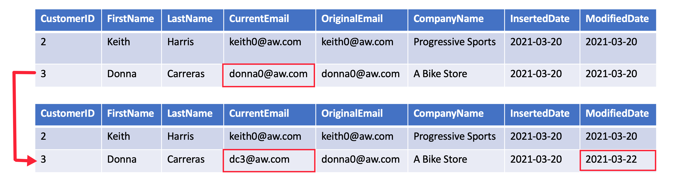

# Slowly Changing Dimension (SCD)

A **Slowly Changing Dimension (SCD)** is one that appropriately manages the change of dimension members over time. It applies when the values of a business entity change over time, and not on a set schedule. A good example of an SCD is a customer dimension, specifically its contact detail columns like email address and phone number.

Star schema design theory refers to common SCD types. The most common are Type 1 and Type 2. In practice a dimension table may support a combination of history tracking methods, including Type 3 and Type 6

## SCD Type 1 

A Type 1 SCD always reflects the latest values, and when changes in source data are detected, the dimension table data is **overwritten**.

## SCD Type 2

A Type 2 SCD supports versioning of dimension members. Often the source system doesn't store versions, so the data warehouse load process detects and manages changes in a dimension table. In this case, the dimension table must use **a surrogate key** to provide a unique reference to a version of the dimension member. It also includes columns that define the **date range validity** of the version (for example, *StartDate* and *EndDate*) and possibly a **flag column** (for example, *IsCurrent*) to easily filter by current dimension members.

## SCD Type 3

A Type 3 SCD supports storing two versions of a dimension member as separate columns. The table includes a column for the current value of a member plus either the original or previous value of the member. So Type 3 uses **additional columns** to track one key instance of history, rather than storing additional rows to track each change like in a Type 2 SCD.

This type of tracking may be used for one or two columns in a dimension table. It is not common to use it for many members of the same table. It is often used in combination with Type 1 or Type 2 members.

